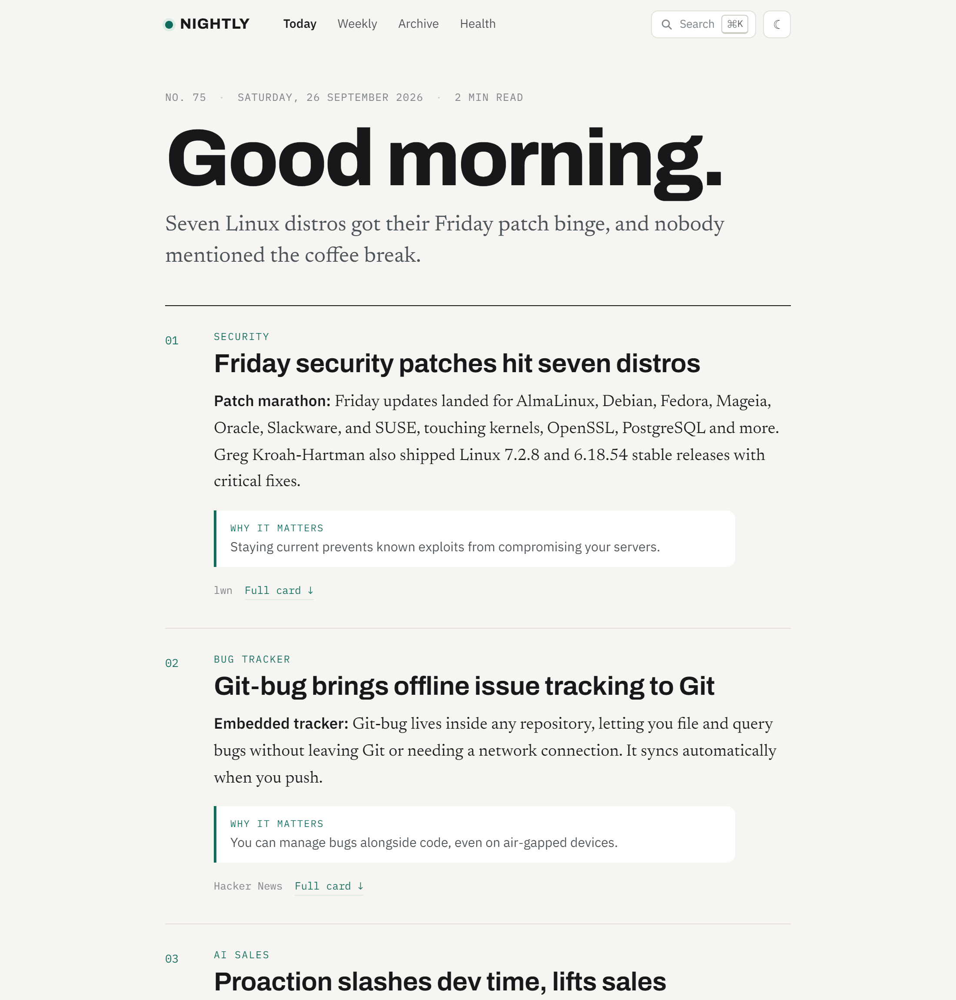

# Nightly digest

[](https://github.com/HassanAiolio/AI-Agent-Digest/actions/workflows/ci.yml)
[](https://github.com/HassanAiolio/AI-Agent-Digest/actions/workflows/nightly.yml)

**Live: [ai-agent-digest.vercel.app](https://ai-agent-digest.vercel.app)** · [Pipeline health](https://ai-agent-digest.vercel.app/health/) · [RSS](https://ai-agent-digest.vercel.app/feed.xml)

Every night a pipeline reads ~150 items from arXiv, lab blogs, Hacker News,
Hugging Face, GitHub Trending, LWN, Hackaday and Codeforces. It throws away
~85% of them and writes the rest up as a morning newsletter for engineers
into AI/ML, embedded systems, competitive programming and CS research.
There's no server to run and it costs $0 a month.



## What you get each morning

- **A morning brief** in the style of Morning Brew. It opens with a greeting,
  then three stories, each with a bolded lead-in and a "why it matters" line,
  followed by quick hits and a number of the day. Every story links to the
  card it was written from.
- **Cards** for every story that made the cut. Each has a factual summary, key
  numbers as chips, a longer detail view on click, a thumbnail, and a
  *Previously in the digest* link to related coverage from the last two
  weeks.
- **Upcoming contests**: a Codeforces strip with local times and live
  countdowns, shown every night until each contest starts.
- **A Sunday recap** that reads the week's seven editions and groups them
  into the three or four themes that kept coming back.
- **Search** across every edition (⌘K or `/`), keyboard navigation (`j`/`k`,
  `enter`, `o`), deep links to any card, light/dark themes, a reading streak,
  and a "you missed 3 editions" prompt when you come back.
- **Like/dislike** buttons that re-rank the page right away and, for the
  owner, feed back into the next night's scoring.

## How it works

```mermaid
flowchart LR
    cron([GitHub Actions cron<br/>02:30 UTC]) --> fetch
    subgraph pipeline [Python pipeline]
        fetch[Fetch<br/>9 sources] --> dedupe[Dedupe<br/>URL · seen-DB · fuzzy title · embeddings]
        dedupe --> score[Score + route<br/>keyword weights]
        score --> sum[Summarize<br/>Groq, batched]
        sum --> verify[Verify<br/>numbers vs source text]
        verify --> relate[Relate + personalize<br/>embeddings, votes]
        relate --> brief[Morning brief<br/>+ Sunday recap]
    end
    brief --> json[(data/*.json<br/>committed)]
    json --> vercel[Vercel deploy hook<br/>Next.js, static pages]
    vercel --> site([Site · RSS · search index])
    site -. votes, owner only .-> fb[/api/feedback/] -.-> json
```



| Stage | What it does | Where |
|---|---|---|
| Fetch | One module per source. A source that fails is skipped for the night; the run carries on. | `pipeline/fetchers/` |
| Dedupe | Four layers: canonical URL, a ledger of everything already published (except upcoming contests), fuzzy title matching, and sentence-embedding similarity (the same story under two titles). | `dedupe.py`, `semantic.py` |
| Score | Source weight + keyword weights − negative keywords (funding rounds, lawsuits). Hacker News items are routed to whichever section fits best. All of it is tunable in YAML. | `scoring.py`, `config.yaml` |
| Summarize | Batched Groq calls in JSON mode. Requests are paced using Groq's own rate-limit headers, with bounded reasoning and a backup model. | `llm.py`, `summarize.py` |
| Verify | Every number or version on a card must appear in the source text. Key facts that don't are dropped; a summary with an invented number falls back to the abstract. | `verify.py` |
| Relate | Local embeddings (fastembed, `bge-small`, runs on CPU with no API) link each item to past coverage and learn from your votes. | `semantic.py` |
| Brief | One LLM call writes the newsletter from tonight's summarized items. Invented item IDs or figures are rejected, and if the call fails a plain brief is built instead. | `brief.py`, `weekly.py` |

## Reliability

It's a hobby project, but it's built to run unattended:

- **The digest always ships.** Any single failure (a source, the LLM, the
  embedding model, the image scraper) degrades that one feature and the
  run continues.
- **Degraded nights are loud.** If the LLM is down, nothing gets published,
  or three or more sources fail, the run still publishes, then marks itself
  red and pings a healthchecks.io `/fail` URL.
- **The LLM is checked, not trusted.** The faithfulness rate (numeric
  claims found in the source text) is recorded every night and shown on
  [/health](https://ai-agent-digest.vercel.app/health/).
- **Scrapers are tested against recorded pages.** GitHub Trending and the
  Anthropic newsroom have no API; saved HTML fixtures turn a markup change
  into a failing test instead of a silently empty section.
- **The feedback endpoint is locked.** Each vote is a commit made with a
  repo token, so `/api/feedback` requires an owner key (compared in
  constant time), checks the request origin, and validates every field.

## Stack

Python 3.12 (requests, feedparser, BeautifulSoup, rapidfuzz, fastembed) ·
Groq (`gpt-oss-120b`, falling back to `gpt-oss-20b`) · Next.js 15 / React 19,
statically generated · Vercel · GitHub Actions for the cron job, CI and
the data commits.

## Run it locally

```bash
pip install -r pipeline/requirements-dev.txt
pytest pipeline                         # offline, no keys needed
python pipeline/main.py --no-summarize  # real fetch, no LLM
GROQ_API_KEY=... python pipeline/main.py

npm install && npm run dev              # http://localhost:3000
```

`python pipeline/main.py --data-dir /tmp/digest` writes somewhere other
than `data/`, and `DIGEST_DATA_DIR=/tmp/digest npm run dev` serves that
copy. That lets you try changes without touching the committed data.

Setup, secrets, tuning and failure modes are in [SETUP.md](SETUP.md).
